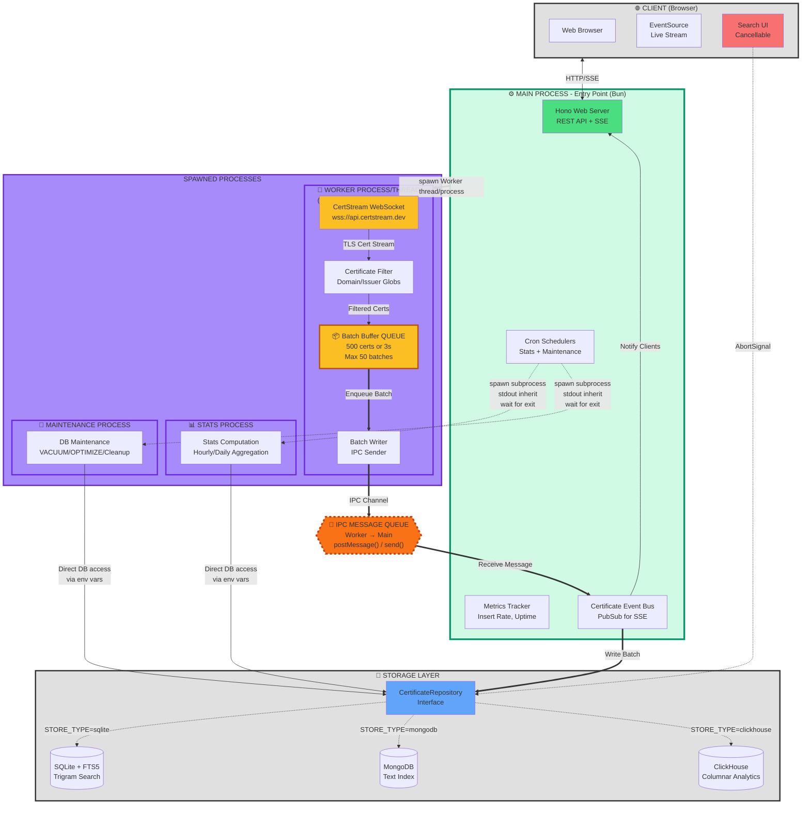

# Aletheia


[](https://opensource.org/licenses/Apache-2.0)

Real-time Certificate Transparency log monitor. Streams certificates from CertStream, stores them with full-text search, and provides a web UI with live updates and cancellable search operations.

## Quick Start

```bash
bun install
cp .env.example .env    # optional: configure filters
bun run dev
```

Open http://localhost:3000

## Technology Stack

- **Runtime**: [Bun](https://bun.sh/) - Fast all-in-one JavaScript runtime
- **Web Framework**: [Hono](https://hono.dev/) - Ultrafast web framework for the edge
- **UI**: Server-rendered JSX + [HTMX](https://htmx.org/) for dynamic interactions
- **Databases**:
  - SQLite with [Kysely](https://kysely.dev/) SQL builder + FTS5 full-text search
  - MongoDB with native driver
  - ClickHouse with [@clickhouse/client-web](https://clickhouse.com/docs/en/integrations/language-clients/javascript)
- **Real-time**: Server-Sent Events (SSE) for live updates and search progress
- **Logging**: [LogTape](https://logtape.org/) structured logging

## Features

- **Real-time ingestion**: Stream certificates from CertStream WebSocket with automatic reconnection
- **Multi-backend storage**: SQLite (FTS5), MongoDB, or ClickHouse - swappable via config
- **Full-text search**: Trigram search across domains, issuers, and subjects with streaming progress
- **Cancellable search**: Client-initiated search cancellation with server-side query termination
- **Advanced search syntax**: `domain:`, `issuer:`, `cn:` prefixes with glob patterns and negation (`-`)
- **Live updates**: Server-Sent Events (SSE) stream of new certificates in real-time
- **Smart filtering**: Configurable domain glob filters and issuer substring filters
- **Deduplication**: Automatic deduplication by SHA1 certificate fingerprint
- **Data retention**: Configurable retention period with automatic cleanup
- **Analytics**: Hourly and daily aggregated statistics with cron scheduling
- **Migration**: Data migration between storage backends with resume support
- **Self-contained**: Compile to single binary with embedded assets
- **Worker management**: Auto-restart ingest worker on crash with exponential backoff

## Configuration

See `.env.example` for all options.

| Variable | Default | Description |
|----------|---------|-------------|
| `STORE_TYPE` | `sqlite` | Storage backend: `sqlite`, `mongodb`, or `clickhouse` |
| `DB_PATH` | `./data/aletheia.sqlite` | SQLite database file path |
| `DB_RETENTION_DAYS` | `90` | Auto-delete certificates older than this |
| `DB_MAINTENANCE_INTERVAL_HOURS` | `6` | How often to run DB maintenance |
| `MONGO_URL` | `mongodb://localhost:27017` | MongoDB connection URL |
| `MONGO_DATABASE` | `aletheia` | MongoDB database name |
| `MONGO_MAX_POOL_SIZE` | `10` | MongoDB connection pool size |
| `CLICKHOUSE_URL` | `http://localhost:8123` | ClickHouse HTTP endpoint |
| `CLICKHOUSE_DATABASE` | `aletheia` | ClickHouse database name |
| `CLICKHOUSE_REQUEST_TIMEOUT_MS` | `30000` | Timeout for regular queries (ms) |
| `CLICKHOUSE_MAINTENANCE_TIMEOUT_MS` | `600000` | Timeout for `OPTIMIZE TABLE` and other long maintenance ops (ms) |
| `CERTSTREAM_URL` | `wss://api.certstream.dev/` | CertStream WebSocket endpoint |
| `BATCH_SIZE` | `500` | Flush buffer when this many certs accumulate |
| `BATCH_INTERVAL` | `3000` | Buffer flush interval in milliseconds |
| `BATCH_MAX_QUEUE_SIZE` | `50` | Max queued batches before backpressure |
| `PORT` | `3000` | HTTP server port |
| `HOST` | `0.0.0.0` | HTTP server bind address |
| `FILTER_DOMAINS` | _(empty = firehose)_ | Comma-separated glob patterns (e.g. `*.google.com,*bank*`) |
| `FILTER_ISSUERS` | _(empty)_ | Comma-separated issuer org substrings |
| `STATS_ENABLED` | `true` | Enable hourly/daily stats computation |
| `STATS_HOURLY_SCHEDULE` | `5 * * * *` | Cron expression for hourly stats |
| `STATS_DAILY_SCHEDULE` | `5 0 * * *` | Cron expression for daily stats |
| `LOG_LEVEL` | `info` | Log level: trace, debug, info, warning, error, fatal |

## Architecture

Multi-process architecture with clear separation of concerns. The main process runs the web server, the worker process handles ingestion, and separate subprocesses are spawned for stats computation and database maintenance.

**Process Model:**
- **Main Process**: Web server, metrics, cron schedulers, event bus
- **Worker Process/Thread**: CertStream ingestion (Worker thread in dev, subprocess in compiled binary)
- **Stats Subprocess**: Spawned on cron schedule, computes aggregations, exits when done
- **Maintenance Subprocess**: Spawned on schedule, runs VACUUM/OPTIMIZE, exits when done

The worker auto-restarts on crash using exponential backoff (1s → 30s max).



### Process Architecture

**Main Process** (⚙️ green border - entry point):
- **Hono Web Server**: Serves REST API, server-rendered JSX+HTMX UI, and SSE streams
- **Metrics Tracker**: Tracks insert rate, uptime, and performance metrics
- **Cron Schedulers**: Triggers stats and maintenance processes on schedule
- **Certificate Event Bus**: In-memory pub/sub for notifying SSE clients of new certificates

**Worker Process/Thread** (🔄 gray border):
- **CertStream WebSocket Client**: Connects to CertStream, parses certificate data, auto-reconnects on disconnect
- **Certificate Filter**: Applies domain glob and issuer substring filters (or firehose mode if disabled)
- **Batch Buffer** (📦 queue): Accumulates certificates, flushes on size (500) or time (3s) threshold, max 50 queued batches
- **Batch Writer**: Sends batches to main process via IPC channel

**Stats Process** (📊 purple border - spawned subprocess):
- **Stats Computation**: Computes hourly/daily aggregated statistics on cron schedule
- Runs as separate subprocess, spawned by main process
- Exits after completing aggregation

**Maintenance Process** (🔧 purple border - spawned subprocess):
- **DB Maintenance**: Runs VACUUM/OPTIMIZE operations and retention cleanup
- Runs as separate subprocess, spawned on startup and periodic schedule
- Exits after completing maintenance

**Storage Layer** (💾):
- **CertificateRepository**: Interface abstracting storage backend (SQLite/MongoDB/ClickHouse)
- Swappable backends via `STORE_TYPE` environment variable

### Visual Legend

- 🟩 **Green thick border** = Main Process (entry point, orchestrator)
- 🟦 **Gray borders** = Supporting components (Client, Storage)
- 🟪 **Purple borders** = Spawned processes (Worker, Stats, Maintenance)
- 🟧 **Orange dashed diamond** = IPC message queue (Worker ↔ Main only)
- 🟨 **Yellow thick border** = Internal batch buffer queue
- **Thick arrows (`==>`)** = Asynchronous/queued operations (Worker IPC, batch writes)
- **Normal arrows (`-->`)** = Synchronous operations (HTTP, SSE, direct DB access)
- **Dotted arrows (`-.->`)** = Simple spawn (Stats/Maintenance), configuration-based (backend selection, AbortSignal)

**Communication Patterns:**
- **Worker → Main**: Bidirectional IPC with message queue (`postMessage`/`send`/`receive`)
- **Stats/Maintenance**: Simple `Bun.spawn()` with inherited stdout/stderr, no message passing
- **Database**: Stats/Maintenance connect directly via environment variables (no IPC)

### Search Cancellation

Search operations support client-initiated cancellation using Web Standard `AbortSignal`:

- **Client**: Cancel button closes EventSource, browser abort on navigation
- **Server**: Detects client disconnect via SSE `stream.onAbort()`, aborts query
- **Database**: ClickHouse terminates HTTP request, MongoDB sends `killOp`, SQLite checks between operations

All database operations respect the abort signal and throw `SearchCancelledError` when cancelled.

## Multi-Store

Switch between backends by setting `STORE_TYPE`:

```bash
# SQLite (default) - zero-config, FTS5 trigram search
STORE_TYPE=sqlite

# MongoDB - horizontal scaling, text index search
STORE_TYPE=mongodb
MONGO_URL=mongodb://localhost:27017

# ClickHouse - columnar analytics
STORE_TYPE=clickhouse
CLICKHOUSE_URL=http://localhost:8123
```

## Search Syntax

| Syntax | Example | Description |
|--------|---------|-------------|
| Free text | `google` | Search across domains, issuer, CN |
| `domain:` | `domain:*.google.com` | Filter by domain |
| `issuer:` | `issuer:Let's Encrypt` | Filter by issuer substring |
| `cn:` | `cn:myserver` | Filter by subject common name |
| `-` prefix | `-domain:example.com` | Negate any filter |

## Migration

Migrate data between storage backends:

```bash
bun run src/index.ts migrate --source sqlite --target mongodb [--batch-size 1000]
```

Migration is resumable: progress is saved to `./data/.migrate-cursor` and automatically resumed if interrupted.

## API

### REST Endpoints

| Endpoint | Method | Description | Response |
|----------|--------|-------------|----------|
| `/` | GET | Home page with search UI | HTML |
| `/api/search` | GET | Search certificates | JSON |
| `/search/stream` | GET | Search with SSE progress | SSE |
| `/api/cert/:fingerprint` | GET | Certificate details | JSON |
| `/cert/:fingerprint` | GET | Certificate detail page | HTML |
| `/api/stats` | GET | Database stats + metrics | JSON |
| `/stats` | GET | Statistics dashboard | HTML |
| `/health` | GET | Health check | JSON |
| `/events/live-stream` | GET | Real-time certificate stream | SSE |

### Search Query Parameters

- `q` - Search query (required, min 2 chars)
- `page` - Page number (default: 1)
- `limit` - Results per page (default: 50, max: 100)

### Search Response (JSON)

```json
{
  "certificates": [...],
  "total": 15234,
  "page": 1,
  "totalPages": 305,
  "limit": 50
}
```

### SSE Events

**Search Progress** (`/search/stream`):
- `progress` - Query progress updates (ClickHouse only)
- `result` - Final search results (HTML)
- `cancelled` - Search was cancelled
- `error-msg` - Search error

**Live Stream** (`/events/live-stream`):
- `certificates` - Batch of new certificates (HTML)
- `heartbeat` - Keep-alive ping (every 30s)

## CLI Commands

```bash
bun run src/index.ts serve              # Start server (default)
bun run src/index.ts migrate --source sqlite --target mongodb
bun run src/index.ts stats [--backfill] # Compute statistics
bun run src/index.ts worker             # Ingest worker (internal)
bun run src/index.ts maintenance        # DB maintenance (internal)
```

## Development

```bash
bun run dev       # Start with watch mode
bun run start     # Production start
bun run check     # TypeScript type-check
bun test          # Run tests
bun compile       # Build self-contained binary to out/aletheia
```

## Production Deployment

### Using the Compiled Binary

```bash
# Compile to standalone binary
bun compile

# Binary includes all dependencies and assets
./out/aletheia serve

# Set environment variables
STORE_TYPE=clickhouse \
CLICKHOUSE_URL=http://clickhouse:8123 \
PORT=3000 \
./out/aletheia serve
```

### Using Docker

Create a `Dockerfile`:

```dockerfile
FROM oven/bun:1 AS builder
WORKDIR /app
COPY package.json bun.lockb ./
RUN bun install --frozen-lockfile
COPY . .
RUN bun run compile

FROM debian:bookworm-slim
COPY --from=builder /app/out/aletheia /usr/local/bin/aletheia
EXPOSE 3000
CMD ["aletheia", "serve"]
```

### Environment Variables

All configuration via environment variables - no config files needed. See [Configuration](#configuration) section for full list.

### Monitoring

- **Health check**: `GET /health` returns uptime and status
- **Metrics**: `GET /api/stats` includes insert rate, total certificates, uptime
- **Structured logs**: JSON logs via LogTape (set `LOG_LEVEL=debug` for detailed logging)

### Recommended Production Settings

```bash
# ClickHouse for high-volume production
STORE_TYPE=clickhouse
CLICKHOUSE_URL=http://clickhouse:8123

# Increase batch size for better throughput
BATCH_SIZE=1000
BATCH_INTERVAL=5000

# Adjust retention based on storage capacity
DB_RETENTION_DAYS=30

# Run maintenance less frequently
DB_MAINTENANCE_INTERVAL_HOURS=24

# Production log level
LOG_LEVEL=info
```

## License

Licensed under the Apache License, Version 2.0. See [LICENSE](LICENSE) for details.

**Patent Grant**: This license includes an explicit patent grant, protecting users and contributors from patent claims.
